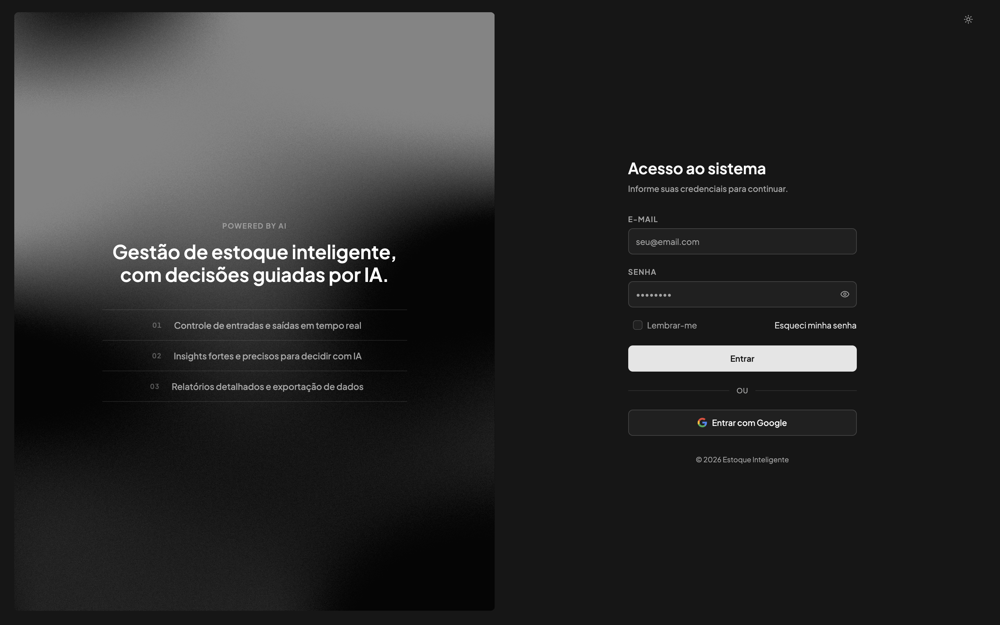
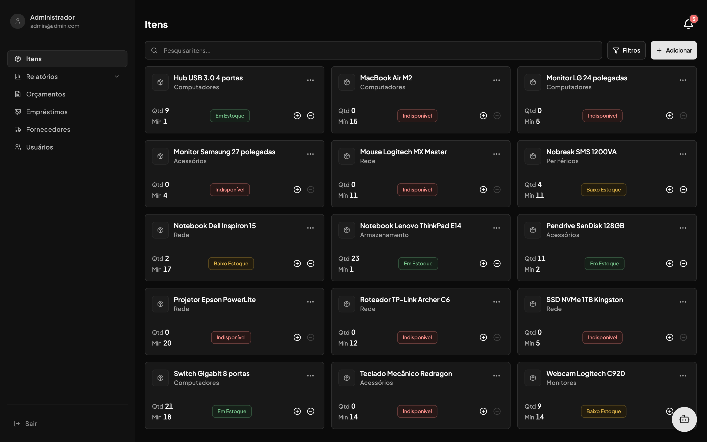
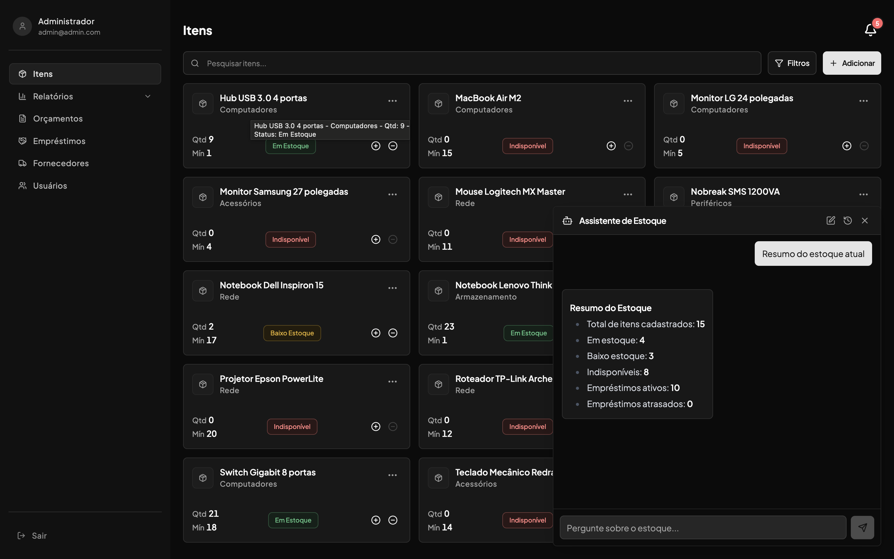
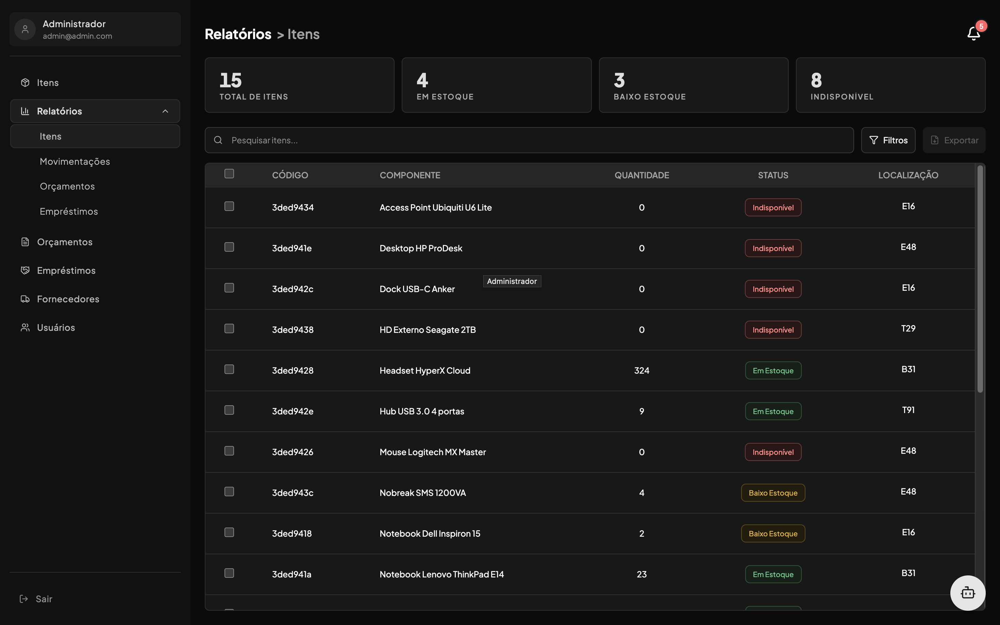
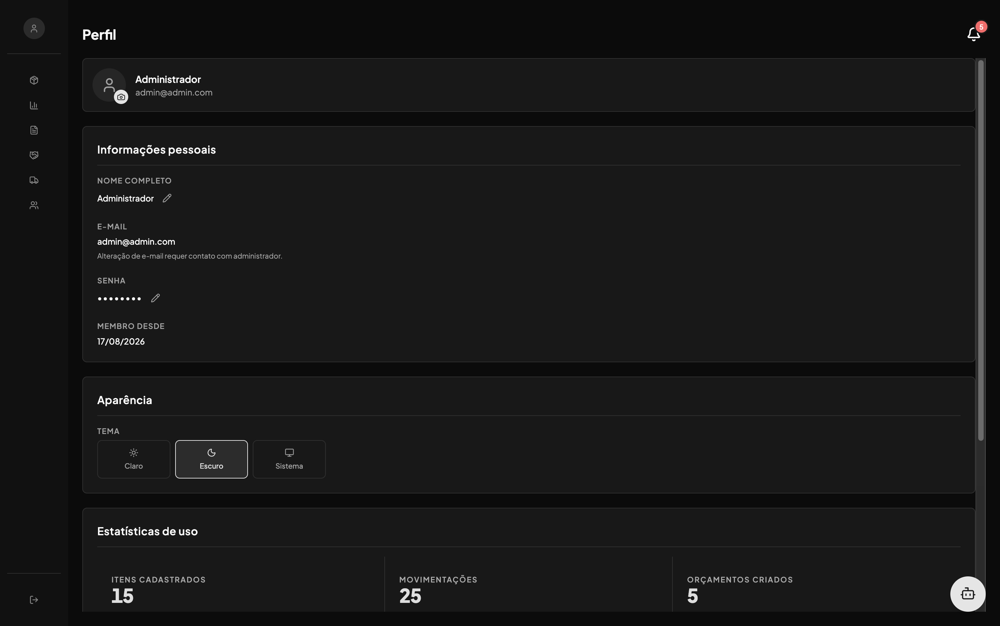

# Estoque Inteligente: Front-end

Interface web do sistema Estoque Inteligente, um projeto de Trabalho de Conclusão de Curso para gestão de estoque com itens, fornecedores, empréstimos, orçamentos, usuários, relatórios e um assistente de IA embutido.

         

## Índice

- [Sobre o projeto](#sobre-o-projeto)
- [Capturas de tela](#capturas-de-tela)
- [Funcionalidades](#funcionalidades)
- [Assistente de IA no front](#assistente-de-ia-no-front)
- [Pré-requisitos](#pré-requisitos)
- [Configuração](#configuração)
- [Executando](#executando)
- [Docker](#docker)
- [Testes](#testes)
- [Estrutura do projeto](#estrutura-do-projeto)
- [Troubleshooting](#troubleshooting)
- [Licença](#licença)

## Sobre o projeto

Este repositório é a camada web do Estoque Inteligente: consome a API separada [`estoque-inteligente-api`](../estoque-inteligente-api) via HTTP, com autenticação de sessão compartilhada (cookie, via Better Auth), e embute um chat com IA cuja lógica completa (agente, ferramentas MCP, observabilidade) vive lá, detalhada no [README dela](../estoque-inteligente-api/README.md#assistente-de-ia).

Repositórios do projeto no grupo GitLab [`estoque-inteligente`](https://gitlab.com/estoque-inteligente): [front](https://gitlab.com/estoque-inteligente/estoque-inteligente-front) e [API](https://gitlab.com/estoque-inteligente/estoque-inteligente-api).

## Capturas de tela

**Login**


**Listagem de itens**


**Assistente de IA**


**Relatórios**


**Perfil**


## Funcionalidades

- **Itens**: listagem com busca e filtros, cadastro, edição e exclusão.
- **Estoque**: acompanhamento de quantidades e alertas visuais de item abaixo do mínimo.
- **Fornecedores e localizações**: cadastros de apoio usados nos filtros de itens.
- **Empréstimos**: registro de saída/devolução de equipamentos, com geração de comprovante em PDF.
- **Orçamentos**: montagem de pedidos com múltiplos itens e exportação em PDF.
- **Usuários e permissões**: gestão de contas e grupos de acesso (RBAC).
- **Relatórios**: itens, movimentações e orçamentos, com gráficos (Recharts) e exportação.
- **Perfil**: dados da própria conta, troca de senha, ativação de conta e recuperação de senha.
- **Modo escuro**: tema claro/escuro persistido (`next-themes`).
- **Assistente de IA**: chat flutuante com histórico de conversas, respostas em streaming e Markdown.

## Assistente de IA no front

- **Histórico de conversas**:  busca e paginação das conversas do usuário, exibidas numa barra lateral dentro do painel do chat.
- **Streaming token a token**: `sendMessage` abre um `fetch` contra `POST /ia/conversas/:id/mensagens` e consome a resposta como Server-Sent Events, atualizando a última mensagem do assistente a cada chunk recebido em vez de esperar a resposta inteira.
- **Cancelamento**: cada envio guarda um `AbortController`; o botão "Cancelar" interrompe o stream em andamento sem derrubar a conversa.
- **Renderização Markdown**: `ChatMessage` usa `react-markdown` + `remark-gfm`, então tabelas, listas e negrito retornados pelo modelo aparecem formatados, com botão de copiar a resposta.
- **Erros tratados como mensagens**: limite de mensagens por minuto, timeout ou falha do modelo aparecem como uma mensagem de erro na própria conversa.

O front não implementa nenhuma lógica de IA por conta própria (sem chamada direta a modelo, sem prompt local); ele é só o consumidor do streaming exposto pela API.

## Pré-requisitos

- Node.js 20 ou superior
- [API](../estoque-inteligente-api) rodando (ver README dela para subir MongoDB, MinIO etc.)

## Configuração

Variáveis de ambiente:

```env
# URL da API para o navegador (client-side)
NEXT_PUBLIC_API_URL=http://localhost:3010

# URL da API para chamadas server-side (dentro do Docker ou SSR)
# No Docker, use o nome do serviço (estoque-inteligente-api) em vez de localhost
API_URL=http://localhost:3010
```

Para rodar a suíte Cypress, configure também `cypress.env.json` (ver `cypress.env.example.json`): `FRONTEND_URL`, `API_URL` e credenciais de um usuário de teste (`TEST_USER_EMAIL`/`TEST_USER_PASSWORD`) já existente na API.

## Executando

```bash
npm install
npm run dev      # servidor de desenvolvimento (Turbopack)
npm run build    # build de produção
npm run start    # servidor de produção (após build)
```

### Docker

```bash
docker build -t estoque-inteligente-front .
```

## Testes

Não há testes unitários. A suíte inteira é E2E via [Cypress](https://www.cypress.io), rodando contra um app real e uma API real.

```bash
npm run test                                                                    # roda tudo (cypress run)
npx cypress open                                                                # modo interativo
npx cypress run --spec "cypress/e2e/itens/01-listagem-pesquisa-filtros.cy.ts"   # uma spec
```

## Estrutura do projeto

```
estoque-inteligente-front/
├── src/
│   ├── app/
│   │   ├── (auth)/          # área logada: itens, fornecedores, emprestimos,
│   │   │                    # orcamentos, usuarios, perfil, relatorios
│   │   └── (no-auth)/       # login, cadastro, ativar-conta, esqueci-senha,
│   │                        # redefinir-senha
│   ├── middleware.ts        # gate de autenticação (valida sessão na API)
│   ├── lib/
│   │   ├── fetchData.ts     # client HTTP client-side (get/post/put/patch/del)
│   │   ├── serverFetch.ts   # client HTTP server-side (Server Components)
│   │   └── auth-client.ts   # cliente Better Auth
│   ├── hooks/               # use-session, use-permissions, useChat, useFormApiErrors...
│   ├── schemas/             # validação Zod por domínio
│   ├── types/               # tipos de resposta da API por domínio
│   ├── components/
│   │   ├── ui/              # shadcn/ui
│   │   ├── chat/            # ChatWidget, ChatPanel, ChatMessage, ChatInput
│   │   └── modal-*.tsx      # modais de domínio (fora de subpastas)
│   ├── contexts/            # ChatContext, SidebarContext
│   └── providers/           # queryProvider (React Query)
├── cypress/
│   ├── e2e/<dominio>/NN-descricao.cy.ts
│   └── support/commands.ts, helpers.ts
├── docs/screenshots/        # imagens usadas neste README
├── components.json          # config shadcn/ui
├── Dockerfile
└── package.json
```

Cada rota de listagem segue o padrão `page.tsx` (Server Component, busca inicial via `serverFetch`) → `_components/*-client.tsx` (Client Component, React Query para refetch/mutations).

## Troubleshooting

**Login funciona mas toda navegação redireciona pra `/login`.** O `middleware.ts` valida a sessão chamando `${API_URL}/api/auth/get-session` no servidor. Confira se `API_URL` está correto (no Docker, é o nome do serviço, não `localhost`) e se a API está de pé.

**Sessão cai sozinha, mesmo logado há pouco tempo.** `fetchData.ts` desloga automaticamente em qualquer 401/498 vindo da API. Normalmente é `BETTER_AUTH_URL`/`COOKIE_DOMAIN` divergente entre front e API (ver `.env.example` da API), não um bug do front.

**Chat de IA sempre responde "Fora do meu escopo" ou não responde nada.** Não é problema do front: confira `GEMINI_API_KEY` e, se o erro for silencioso, os logs (`DEBUGLOG=true`), ambos do lado da API.

**Cypress falha logo no primeiro teste, antes de qualquer asserção.** Falta `cypress.env.json` (copie de `cypress.env.example.json`) com `FRONTEND_URL`, `API_URL` e um usuário de teste que já existe na API.

**Build ou dev trava/comporta estranho depois de mexer em dependências.** Apague o cache do Turbopack: `rm -rf .next`.

## Licença

[MIT](LICENSE).
